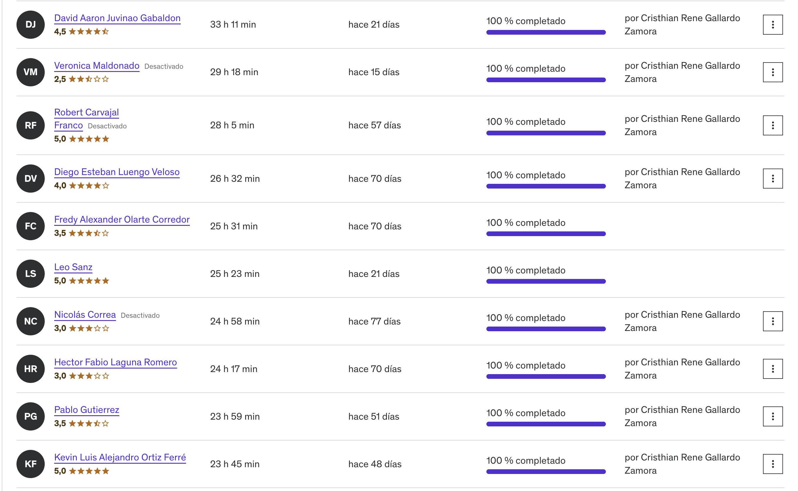
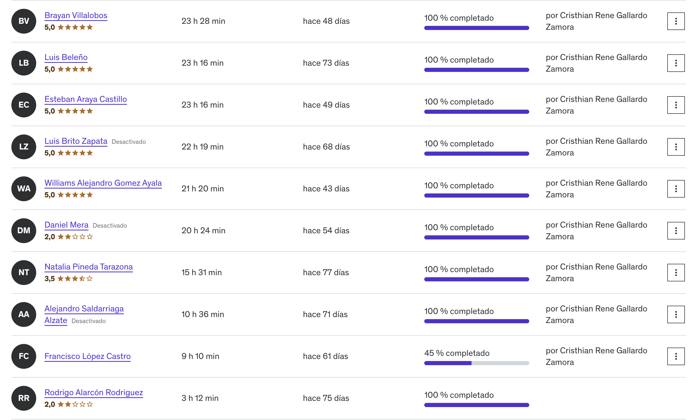
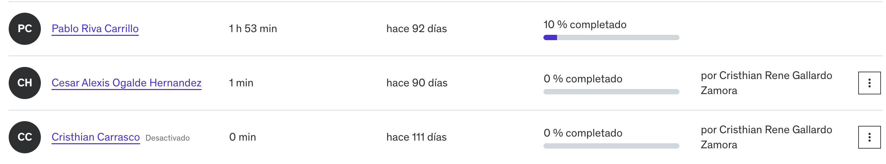

# Comunidad Cloud

## Descripción

Esta comunidad tiene por objetivo la difusión y colaboración del conocimiento de las principales Nubes tales como Amazon Web Services (AWS), Google Cloud Platform (GCP) y Azure Cloud (Microsoft) en los ámbitos de  Arquitectura, Negocio, Soporte, Desarrollo, Inteligencia, Machine Learning, etc. Tendrá un foco de incremento de habilidades,  visión de la nube, referencias de arquitectura, diseño e implementación.

## Alineación con la estrategia de Image Maker

Mensualmente habrá una instancia para revisar las novedades de la Nube, identificar las estrategias de Im en relación a la Nube
Esta reunión estará Robinson Mancilla, Pablo Frints y Jorge Silva.

## Noticia

Se hará una Introducción a las Nubes (sería una presentación inicial para todo público) primera session.

Ya tenemos con MakerPath una certificación en proceso y quiero anunciar la entrega de vouchers de certificación (Kat Navarro hará la entrega )

Iniciar nuevos procesos de aprendizajes  Azure / AWS / GCP
Proxima cita Miércoles 13 de Sept de 17:00 a 18:00

## ¿Como nació?

Dado que hay personas que de forma autonoma son capaces de aprender, la empresa tiene un programa de aprendizaje y la necesidad de los clientes de migrar sistemas legados a las nubes es que se armó un primer grupo con el objeto apoyarlos en makerpath para un curso básico dela nube Azure AZ-900 (mas de 20 Makers), el desafío fue realizar el curso en el Q anterior y quienes se sintieran motivados ImageMaker les daba un voucher para una cwrtificación oficial, hoy hay 8 Makers que tendrán esta oportunidad.

Dado el éxito y las inquietudes de otros makers en explorar lo mismo en otras nubes es que se pensó en armar una comunidad para apoyar y compartir ese proceso, apoyando con todo lo necesario para aumentar el conocimiento cloud.

## Grupo Inicial

El grupo inicial se llama : azure-fundamentals y será reemplazado por comunidad-cloud
Los participantes son :

## Miembros

Miembros parte del programa MakerPath, cada uno debió cumplir con el curso AZ-900 de Udemy

1. alejandro.perez@imagemaker.com
1. brayan.villalobos@imagemaker.com
1. catherine.vivanco@imagemaker.com
1. cristhian.carrasco@imagemaker.com
1. Daniel.mera@imagemaker.com
1. david.juvinao@imagemaker.com
1. diego.luengo@imagemaker.com
1. esteban.araya@imagemaker.com
1. francisco.lopez@imagemaker.com
1. fredy.olarte@imagemaker.com
1. hector.laguna@imagemaker.com
1. kevin.ortiz@imagemaker.com
1. leo.sanz@imagemaker.com
1. luis.beleno@imagemaker.com
1. natalia.pineda@imagemaker.com
1. nicolas.correa@imagemaker.com
1. pablo.riva@imagemaker.com
1. robert.carvajal@imagemaker.com
1. rodrigo.alarcon@imagemaker.com
1. williams.gomez@imagemaker.com

Resultados del curso Maker Path

## Personas beneficiadas por el Voucher

Este voucher tiene un periodo de tiempo para agendar examen oficial AZ-900. 

1. williams.gomez@imagemaker.com 
1. rodrigo.alarcon@imagemaker.com
1. david.juvinao@imagemaker.com
1. fredy.olarte@imagemaker.com 
1. diego.luengo@imagemaker.com
1. esteban.araya@imagemaker.com
1. leo.sanz@imagemaker.com
1. pablo.gutierrez@imagemaker.com

Kay Navarro va a enviar el comunicadio del voucher y como se debe usar, se coordinará una reunión para agendar el exámen.

## Plan de la comunidad (Miércoles Cloud's)

Se describe cuáles serán los temas las proximas semanas.

## Estrategia Jueves 7 de Septiembre 2023
Se envia el programa del inicio de la comunidad por slack al team de estrategia y se recibieron los siguientes comentarios:
1. Rob, ¿Cómo se dará continuidad al uso de la nube? ¿como practicar y entrenar?
1. 

### 13 de Septiembre de 17:00 a 18:00
Tema: Inicio y bienvanida

Actividades son :

- Bienvenida e Inducción Gneral de las Nubes (César Ogalde)
- Definición de estructura y temas de la comunidad
- Cierre e Invitación siguiente meet.

### 20 de Septiembre de 17:00 a 18:00
Tema: Rutas de Aprendisaje en la Nube

Actividades son :

- Identificar Rutas de Aprendisaje AWS / GCP / Azure (César Ogalde)
- Identificación de interés de roles de los miembros y metas de la comunidad.
- Cierre e Invitación siguiente meet.

### 27 de Septiembre de 17:00 a 18:00
Tema: Estado del Arte de las Nubes
es un resumen general del estado de las nubes en la industria.

- Dar una mirada de la visión de las Nubes para tebner un contexto de actualiadad.
- Opiniones y Comentarios
- Cierre e Invitación siguiente meet.

··· Pendientes Otros Temas segun la reunión de Inicio y bienvenida.